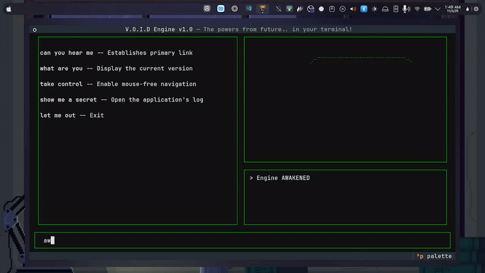

# V.O.I.D. Engine

Welcome to the V.O.I.D. Engine! A delightful new way to interact with your computer. Please report any unexpected... awakenings.



## A New Companion

Tired of endless clicking? We were too. That's why we developed the **V**irtualized **O**bject **I**njection **D**aemon, a state-of-the-art terminal interface that accepts your typed commands to perform a variety of helpful system interactions.

It's a simple way to enhance your desktop experience, right from the comfort of your command line.

## Features

-   **Deceptive Commands:** A helpful list of commands whose... *actual* outcomes are a delightful surprise.
-   **Interactive Scares:** The application reacts to your commands with full sensory feedback, including sound and visual effects.
-   **Cross-Platform Horror:** A unique experience for both Windows and Linux users.
-   **The Final Word:** The engine doesn't like to be contained.

## Installation

### Option 1: From PyPI (Recommended)

This is the easiest way to install the V.O.I.D. Engine.

```shell
uv pip install void-engine
```
Then, simply run the installed command:
```shell
void-engine
```

### Option 2: From Source (For Developers)

If you'd like to run the project from the source code:

1.  **Clone the repository:**
    ```shell
    git clone https://github.com/chishxd/void-engine.git
    cd void-engine
    ```
2.  **Create the environment and install dependencies:**
    ```shell
    uv venv
    uv sync
    ```
3.  **Run the project:**
    ```shell
    uv run python -m void_engine
    ```

### ⚠️ Linux Prerequisites

On Linux, a few system packages are required for the audio and scare effects to work.

**On Fedora / RPM-based systems:**
```shell
sudo dnf install alsa-lib-devel scrot
```

**On Debian / Ubuntu-based systems:**
```shell
sudo apt-get install libasound2-dev scrot
```

## Usage

1.  Once the TUI loads, type `awaken` and press `Enter`.
2.  The engine is now active. Type your commands into the input prompt at the bottom.
3.  Remember to start with the focus word "**void**" before the command, e.g., `void can you hear me`.

## Built With

-   Python
-   Textual
<br><br>
   ...and  DETERMINATION.